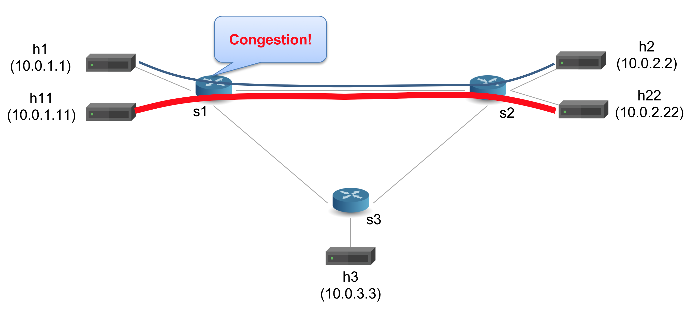

# Implementing Queue-priority


## Step 1: Run the code

1. In your shell, run:
   ```bash
   make run
   ```

2. We want to send a low rate traffic from `h1` to `h2` and a high
rate iperf traffic from `h11` to `h22`.  The link between `s1` and
`s2` is common between the flows and is a bottleneck because we
reduced its bandwidth to 512kbps in topology.json.



3. You should now see a Mininet command prompt. Open four terminals
for `h1`, `h11`, `h2`, `h22`, respectively:
   ```bash
   mininet> xterm h1 h11 h2 h22
   ```
3. In `h2`'s XTerm, start the server that captures packets:
   ```bash
   ./receive.py
   ```
4. in `h22`'s XTerm, start the iperf UDP server:
   ```bash
   iperf -s -u
   ```
5. In `h1`'s XTerm, send one packet per second to `h2` using send.py
say for 30 seconds:
   ```bash
   ./send.py 10.0.2.2 "P4 is cool" 30
   ```
   The message "P4 is cool" should be received in `h2`'s xterm,
6. In `h11`'s XTerm, start iperf client sending for 15 seconds
   ```bash
   iperf -c 10.0.2.22 -t 15 -u
   ```
7. At `h2`, the `ipv4.ttl` field should be always set to 7 (highest priority)
8. type `exit` to close each XTerm window
